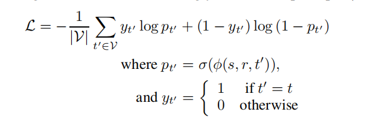
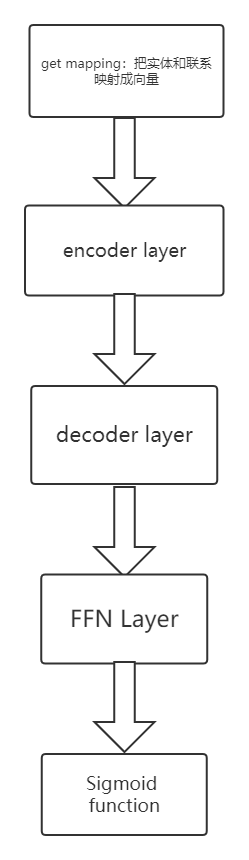
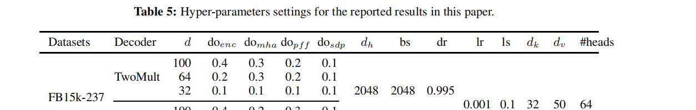
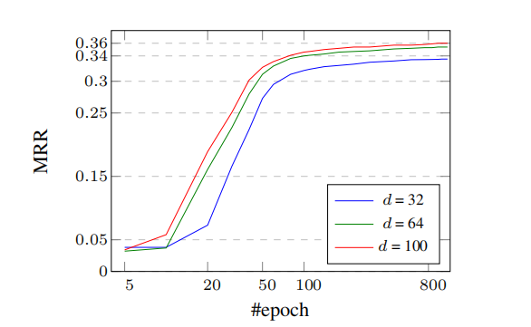

# HW2 链接预测论文复现

## 选题

**Self-attention Presents Low-dimensional Knowledge Graph Embeddings for Link Prediction**

## abstract 和 introduction 翻译

### abstract 翻译

现有很多模型尝试通过把知识图谱编码为相对低维度的表示来解决链接预测问题（也叫知识图谱补全）。然而，目前最先进的方法是通过比较高的维度来编码知识图谱，这在处理规模巨大的知识库的时候会带来可扩展性差的问题。最近的一些使用 transformer 作为编码器的工作取得了成功，但是现有的模型仍然有可扩展性的问题。为了突破这一局限，我们引入基于 transformer 的模型来获得相当低维度的编码表示。我们利用了多头注意力产生键应用于查询相关的投影来捕获实体和关系之间的互信息。在 WN18RR 和 FB15k-237 上的实验结果显示了我们的模型比目前先进的方法取得了相对来说更好的效果。值得注意的是，我们获得了相当好的结果，但是在表示维度上比目前最先进的五种方法少了 66.9%。

### introduction 翻译

现实世界中的很多问题，比如问答、信息获取、推荐系统、搜索引擎都可以被表示为知识图谱（由实体和他们之间的关系组成的网络结构）。然而，由于观察的缺乏和探索工作的高成本，这些知识图谱常常是不完整的，或者可能缺失很多实体之间的联系关系。链接预测，也叫知识图谱补全，是一种通过自动推理来预测实体之间缺失的链接。

现有的在知识图谱上的链接预测方法主要分布在两个大方向: 基于嵌入（用向量来表示实体）的方法和基于神经网络的方法。基于嵌入的方法先把一个嵌入向量和每个实体和关系关联起来，一般是在欧几里得空间，复空间或者双曲空间。接着一些方法学习源实体和目的实体之间的线性变换，在这过程中考虑他们之间的联系 (Bordes et al.,2013; Wang et al., 2014; Sun et al., 2019; Balazevic et al., 2019; Chami et al., 2020),；另一些方法匹配实体的潜在语义信息和联系 (Nickel et al., 2011; Yang et al.,2015; Trouillon et al., 2016; Kazemi and Poole, 2018; Lacroix et al., 2018; ZHANG et al., 2019)。基于嵌入的方法需要高维的表示来有效的编码知识图谱中的全部信息。因此，他们在处理现实世界中的大的知识图谱的时候会碰到可扩展性的问题。

神经网络方法  (Socher et al., 2013; Schlichtkrull et al., 2018;Dettmers et al., 2018; Bansal et al., 2019; Balaževi´c et al., 2019; Yao et al., 2019; Wang et al.,2019; Vashishth et al., 2020a; Chen et al., 2021) 通过把一些知识存储在模型的自由的参数里面来让模型知识图谱共享来丰富表示的方法。然而，现有的神经网络方法也是通过提高维度的方式来获得最好的结果。因此，降低维度严重损害了神经网络方法和嵌入方法的效果，这里就需要由模型来填补这个空缺。

受到近期的基于 transformer 的工作 (Vaswani et al., 2017) 的进展的启发，一些工作 CoKE (Wang et al., 2019) and HittER (Chen et al., 2021) 通过用 transformer 作为知识图谱的编码器取得了很好的效果。然而这些模型也用了高维的嵌入来获得较好的效果因此也有可扩展性的问题。还有，他们都使用了很大的模型，提供了太多的自由参数来存储信息，因此显著提高了时间和空间复杂度。

我们提出一个基于 transformer 的模型来解决前面提到的问题。我们发现注意力头数对于捕获不同投影空间之间的依赖关系非常重要。因此，相比于之前的模型，我们使用一个编码器块但是提高了注意力头数，减少了参数规模。另外，我们通过在编码器上堆砌解码器取得了很好的效果，获得了低维的表示。

自注意力机制被证实在有效的捕获一个序列内的互信息和依赖关系上足够强大。我们模型中的自注意力矩阵应用了一种查询相关的在输入的查询上的线性投影，并负责传播输入的实体和联系的依赖和相互作用。因此，我们的模型生成了查询相关的表示，而不只是记忆了通用的嵌入表示。

我们在 FB15k-237 和 WN18RR 上的实验结果，表明了我们的模型的效果和目前最先进的方法相比也是有竞争力的。但是，我们以较小的嵌入维度（减少了 66.9% ）获得了这个效果。因此，我们有效解决了可扩展性的问题，并在不引入更多关于输入的基础假设的前提下取得了很好的效果，这也让我们的模型在不同的数据集上的表现更加一致。

## 问题描述

现实世界中的很多问题，比如问答系统、信息获取、推荐系统、搜索引擎等都可以用知识图谱来表示，在知识图谱中实体之间由联系组成复杂网络。然而由于观察数据的缺失或者是高成本，实体之间的联系有很多缺失。链接预测，或者叫知识图谱补全，是用来解决这个问题的一种方法。

然而，目前主流的方法取得较好的效果都需要较高维度的表示方法，而高维在处理大的知识图谱时会带来可扩展性问题（scalability）。

本文需要解决的问题是给知识图谱中的元素（节点，边）编码成一个相对低维的表示。

## 输入、输出、模型算法描述以及框架图

### 输入输出

输入：一个三元组列表，表示一个知识图谱。（每个三元组是 (实体，关系，实体）)

输出：一个 score 预测 target，但是实际应用时应用的是中间产物，即嵌入向量。

### 算法描述及框架图

#### 算法流程：

预测阶段：

1. 给每个实体和联系分配一个 d 维的嵌入向量

2. 考虑每个 (s,r,t) 中的的 (s,r) 对，这些 (s, r) 对组成的序列输入 transformer encoder

3. 为上一步的序列中的 s, r 生成一个相对低维的向量表示

4. 根据上一步计算出的表示来预测 target 的 score（即根据 s，r 来预测 target）

5. 把 score 传到 sigmoid 函数里面转换成概率的形式

形式化的说，输出的矩阵表示 $H_o =  FFN(MultiH(Q, K, V ))$

其中，$MultiH(Q, K, V ) = [H_1, . . . , H_h]W_O$, $H_i = softmax(\frac{Q_iK_i^T}{\sqrt{d_k}})V_i$,
$FFN(x) = max(0, xW_1 + b_1)W_2 + b_2$

$Q_i = QW^Q_i, K_i = KW_i^K, V_i = VW^V_i$

训练阶段：

使用  reciprocal learning，交叉熵损失函数。

其中 $\phi$ 有两个选择，本文默认的选择是 TwoMult

TwoMult: 
$\phi(s, r, t) = \widetilde{e_r}^T e_t$

TuckER:
$\phi(s, r, t) = W_c × 1 \widetilde{e_s} ×2 \widetilde{e_r} ×3 \widetilde{e_t}$

#### 框架图

## 评价指标以及计算公式

Mean Reciprocal Rate

reciprocal rank 是指，第一个正确答案的排名的倒数。MRR是指多个查询语句的排名倒数的均值。其中 $rank_i$ 表示第i个查询语句的第一个正确答案的排名。

## 对比方法及引用出处

(1)ConvE: Tim Dettmers, Pasquale Minervini, Pontus Stenetorp, and Sebastian Riedel. Convolutional 2d
knowledge graph embeddings. In Thirty-second AAAI conference on artificial intelligence, 2018.
(2)A2N: Trapit Bansal, Da-Cheng Juan, Sujith Ravi, and Andrew McCallum. A2n: Attending to neighbors
for knowledge graph inference. In Proceedings of the 57th Annual Meeting of the Association for
Computational Linguistics, pages 4387–4392, 2019.
(3)CoKE: Quan Wang, Pingping Huang, Haifeng Wang, Songtai Dai, Wenbin Jiang, Jing Liu, Yajuan Lyu, and Hua Wu. Coke: Contextualized knowledge graph embedding. arXiv:1911.02168, 2019
(4)HittER: Sanxing Chen, Xiaodong Liu, Jianfeng Gao, Jian Jiao, Ruofei Zhang, and Yangfeng Ji. Hitter: Hierarchical transformers for knowledge graph embeddings. In Proceedings of the 2021 Conference on Empirical Methods in Natural Language Processing (EMNLP), 2021.
(5)TuckER: Ivana Balazevic, Carl Allen, and Timothy Hospedales. TuckER: Tensor factorization for knowledge graph completion. In Proceedings of the 2019 Conference on Empirical Methods in Natural Language Processing and the 9th International Joint Conference on Natural Language Processing (EMNLP-IJCNLP), pages 5185–5194, 2019.
(6)RotatE: Zhiqing Sun, Zhi-Hong Deng, Jian-Yun Nie, Jian Tang. RotatE: Knowledge Graph Embedding by Relational Rotation in Complex Space

## 结果

我在  FB15k-237 数据集上进行了一组实验，超参数的设置同文章中的如下表格

由于资源限制，每个设置下我只跑了 105 epoch，取得了和文章中相近的结果。(文章结果如下图)

而我的结果如下:
d = 100:
Epoch 0105 | Loss 0.0010488 | Best MRR 0.3422 | Best epoch 0104

d = 64:
Epoch 0105 | Loss 0.0010575 | Best MRR 0.3369 | Best epoch 0104

d = 32:
Epoch 0105 | Loss 0.0010794 | Best MRR 0.3175 | Best epoch 0105

训练日志见本文件夹下的 log-d32,log-d64, log-d100

