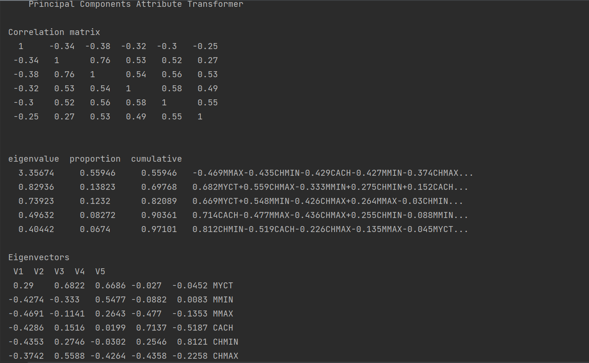

# 第三次作业-数据降维 实验报告

## 1. 对选择的方法的理解

我选择的降维方法是主成分分析（Principal Component Analysis)。

主成分分析是一种常用的无监督学习降维算法。这一方法利用正交变换把由线性相关的变量表示的观测数据转换为少数几个由线性无关变量表示的数据，线性无关的变量称为主成分。

在主成分分析中，首先对给定的数据进行标准化，使数据每一变量服从平均值为 0，方差为 1 的分布。之后再对数据做正交变换，原来由线性相关变量表示的数据，通过正交变换变成若干个由线性无关变量表示的数据。新变量是可能的正交变换中变量的方差的和（信息保存量）最大的。 将新变量依次称为第一主成分，第二主成分等。通过主成分分析，可以用主成分近似地表示原始数据，这就是主成分分析降维的基本思想。

## 2. 对数据集的分析和处理思路

### 2.1 数据集简介

数据集是关于 cpu 的信息，一共有 7 维，去除一个 label，有六维。

### 2.2 数据集处理思路

1. 先去除缺失值，由于数据集比较小，所以我人眼看了一遍发现没有缺失值，故跳过这一步。

2. 对数据做标准化，将数据变换到平均值为 0 方差为 1.
3. 运行主成分分析算法。

## 3. 实验结果

默认保留的 proportion 是 0.95，可以看到在这个设置下维度从 6 降到了 5，且保存了大部分的信息。

## 参考资料

1. weka 官方文档
2. 《统计学习方法》. 李航