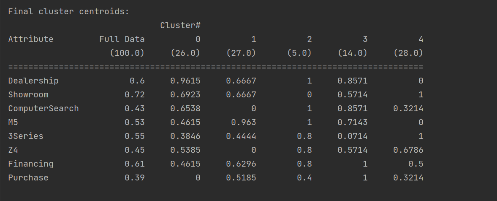

# 第五次作业-聚类 实验报告

## 1. 对所选方法的理解

K 均值聚类是基于样本集合划分的聚类算法。K 均值聚类将样本集合划分为 K 个子集，构成 K 个类，将 n 个样本划分到 K 个类中，每个样本到其所属类的中心的距离最小，每个样本只能属于一个类。优化的目标是所有样本到其所属的样本中心的距离之和。

## 2. 处理分析数据集的思路

### 2.1 数据集简介

数据集的基本情况：

Dealership: 是否去过汽车经销店，0/1 表示 没有/有 

Showroom: 顾客是否有看展示间，0/1 表示 没有/有 

ComputerSearch：顾客是否使用电脑搜索，0/1 表示 没有/有 

M5: 顾客是否有看 BMW M5系车，0/1 表示 没有/有 

3 Series：顾客是否有看 BMW 3系车，0/1 表示 没有/有 

Z4: 顾客是否有看BMW Z4 敞篷跑车，0/1 表示 没有/有 

Financing: 顾客是否符合贷款资格，0/1 表示 没有/有 

Purchase: 顾客是否真实购车，0/1 表示 没有/有

数据集中没有缺失值，直接进行聚类。

### 2.2 处理思路

weka 内置的 KMeans 算法自带对缺失值的处理，因此直接把数据输入 SimpleKMeans 算法进行聚类。

## 3. 实验结果

使用的 K = 5，得到如下实验结果。

可以看出将客户群体分为五类时，五类客户群体分别有如下的特征，cluster 0 属于只看车不买车的群体，cluster 1 属于 M5 的爱好者，cluster 2 样本个数较少，意义不大，cluster 3 属于 bmw 爱好者，购买率高，cluster 4 属于 bmw 的初级客户，更偏向关注便宜的车型。

## 4. 参考资料

1. weka 官方文档
2. 《统计学习方法》. 李航