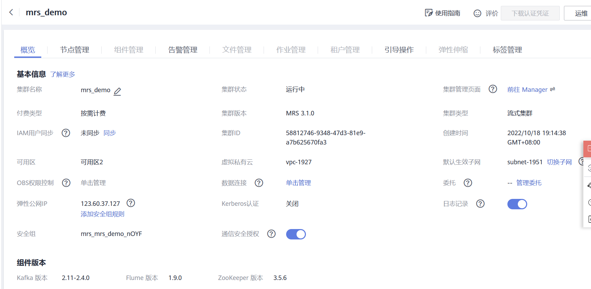
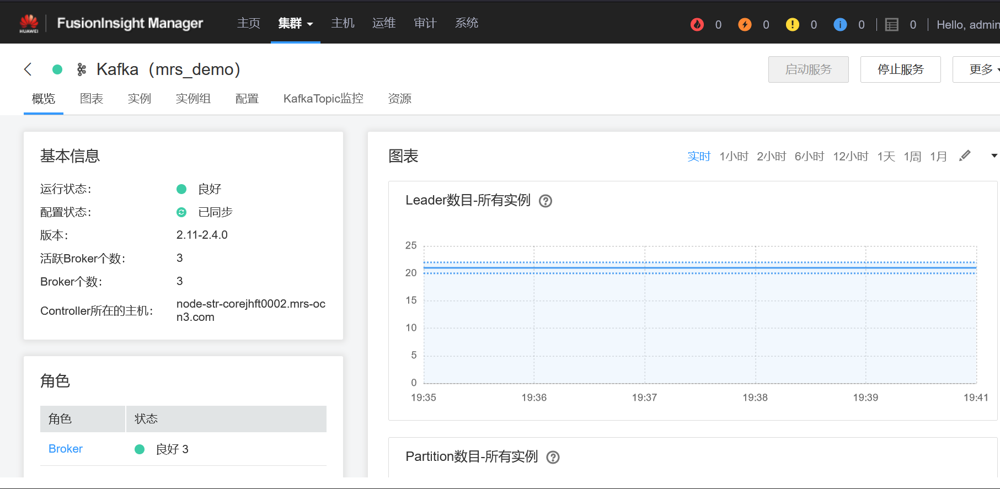
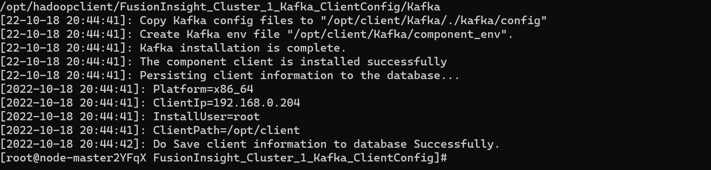
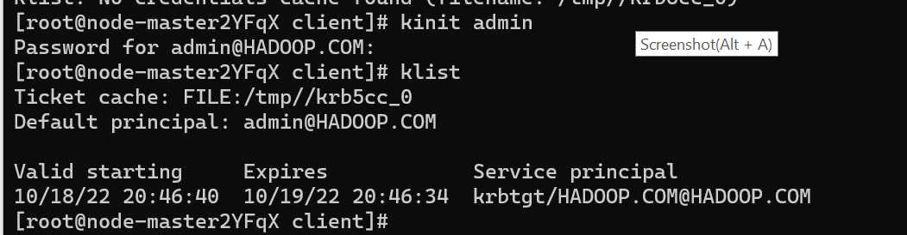
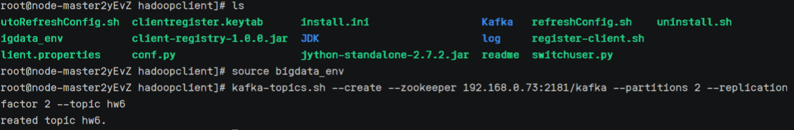
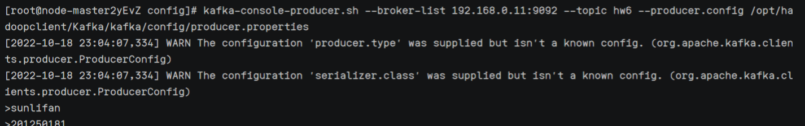
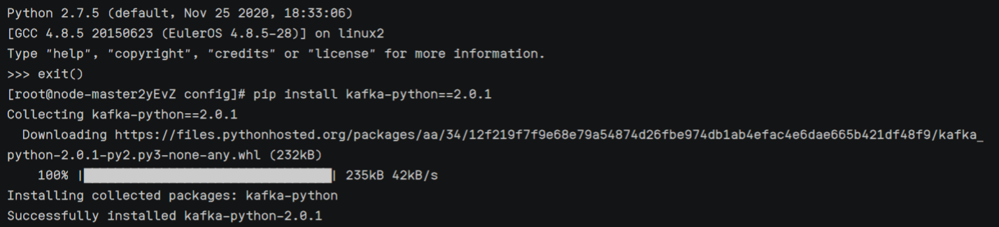
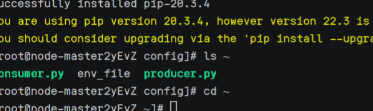
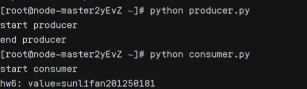

# 大数据分析-作业6：基于 MRS 的 Kafka 实验报告

## Kafka 简介

Apache Kafka起源于LinkedIn，后来于2011年成为开源Apache项目，然后于2012年成为First-class  Apache项目。Kafka是用Scala和Java编写的。 Apache Kafka是基于发布订阅的容错消息系统。  它是快速，可扩展和设计分布。

## 关键步骤

### 1. 集群购买

在华为云的大数据 : MapReduce 服务中购买集群，购买过程和配置参考华为云的手册。

集群部署成功的结果。





### 2.  Kafka 客户端安装

前往 Manager, 以管理员身份进入, 选择 Kafka



下载安装包之后 scp 到服务器，解压之后安装 kafka 客户端



klist 检查，安装成功



### 3. Kafka 消息传递

创建 topic

在安装目录下输入命令 `source bigdata_env`

然后再输入 `kafka-topics.sh --create --zookeeper 192.168.0.73:2181/kafka --partitions 2 --replication-factor 2 --topic hw6` 来创建 topic hw6



产生消息

输入命令 `kafka-console-producer.sh --broker-list 192.168.0.11:9092 --topic hw6 --producer.config /opt/hadoopclient/Kafka/kafka/config/producer.properties`



消费消息

输入命令 `kafka-consoconsumer.sh --topic hw6 --bootstrap-server 192.168.0.11:9092 --consumer.config /opt/hadoopclient/Kafka/kafka/config/consumer.properties`


### 4. Python 使用 Kafka

1. 准备环境：安装 python 版的 kafka 客户端

   使用 `pip install kafka-python==2.0.1` 来安装



2. 导入 producer.py 和 consumer.py,这里我是从本地通过 scp 上传到云服务器上



具体的 producer.py 和 consumer.py 代码如下

```python
# producer.py
#!/usr/bin/python3

from kafka import KafkaProducer

conf = {
    'bootstrap_servers': ["192.168.0.11:9092"],
    'topic_name': 'hw6',
}

print('start producer')
producer = KafkaProducer(bootstrap_servers=conf['bootstrap_servers'])

data = bytes('sunlifan201250181').encode('utf-8')
producer.send(conf['topic_name'], data)
producer.close()
print('end producer')
```

```python
# consumer.py
#!/usr/bin/python3

from kafka import KafkaConsumer

conf = {
    'bootstrap_servers': ["192.168.0.11:9092"],
    'topic_name': 'hw6',
    'consumer_id': 'consumer-id'
}

print('start consumer')
consumer = KafkaConsumer(conf['topic_name'],
                        bootstrap_servers=conf['bootstrap_servers'],
                        group_id=conf['consumer_id'])

for message in consumer:
    print("%s: value=%s" % (message.topic, message.value))

print('end consumer')
```


3. 执行 producer.py 和 consumer.py



## 参考资料

实验手册

华为云官方文档

Kafka 官网